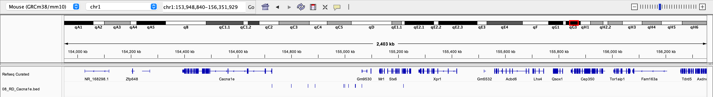
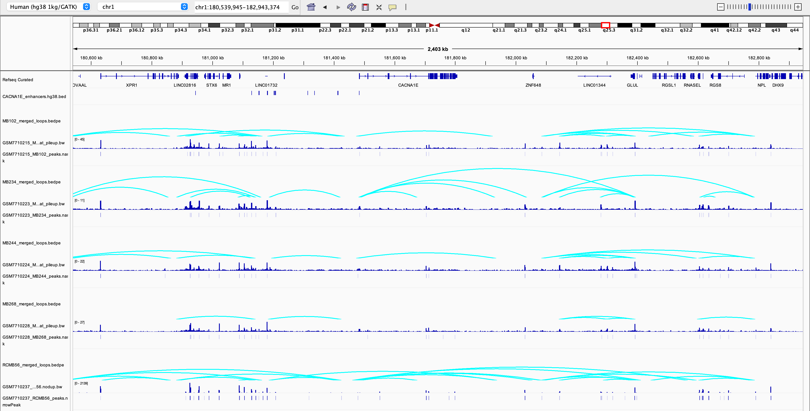
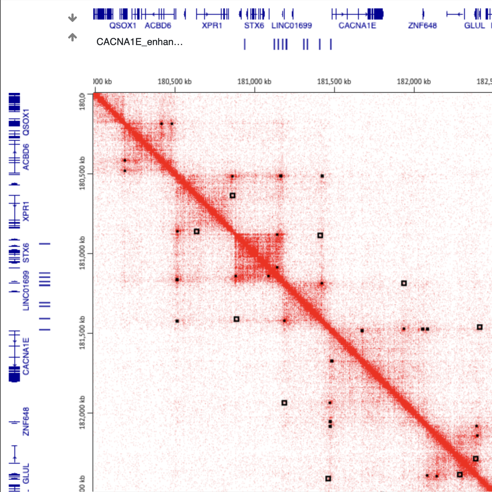

# Medulloblastoma chromatin interactions from Hi-C
Map putative regulators of genes of interest in mouse SHHMB models to human tumors, to see if they overlap human regulatory regions and/or chromatin interactins in human.

## Requirements
- [Juicebox desktop](https://github.com/aidenlab/JuiceboxGUI/releases), [Juicebox web browser](https://aidenlab.org/juicebox/), or another Hi-C browser
- IGV or another genome browser
- [CrossMap](https://crossmap.sourceforge.net/) or another reference coordinate remapper (eg. UCSC liftOver) 

## Data
- Download human MB Hi-C data from GEO ID [GSE240410](https://www.ncbi.nlm.nih.gov/geo/query/acc.cgi?acc=GSE240410)
- Download human MB ATAC-seq data from GEO ID [GSE240830](https://www.ncbi.nlm.nih.gov/geo/query/acc.cgi?acc=GSE240830)
- (Mouse enhancers from Kohei), see [data/peaks](../data/peaks)
- mm10ToHg38.over.chain.gz from https://hgdownload.soe.ucsc.edu/goldenPath/mm10/liftOver/
The human MBSHH samples with both ATAC and Hi-C data are MB102, MB234, MB244, MB268 and RCMB56.

## Methods
- Map mouse enhancers to human reference (see [crossmap_mouse_enhancers.sh](../scripts/crossmap_mouse_enhancers.sh)).
- Load the mouse enhancers (.bed) on the mouse genome mm10 in IGV. Save the session.

- Load the human enhancers (.bed) in the human genome **hg38 1kg/GATK**. Note that in the next step, the .bw files will fail to load if you use the default hg38. Save the session. Check that local genome sequence seems to be preserved (gene synteny, etc.)
- For each human MBSHH sample, load loops (.bedpe), peaks (.narrowPeak), and ATAC sequencing depth (.bw).

- Load the human enhancers and loops in Juicebox. 
